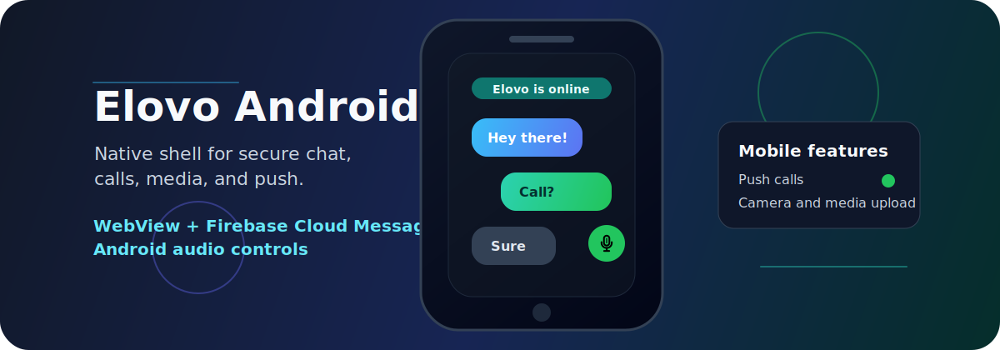

<div align="center">
  

  <br />

  
  
  
  
  
</div>

# Elovo Android 💬

Elovo Android is the mobile companion app for Elovo Chat. It wraps the hosted Elovo web client in a native Android shell and adds device-level features such as Firebase push notifications, incoming-call actions, audio routing, proximity sensor support, media upload, file download, and Android runtime permissions.

Production web client: [elovo-app.onrender.com](https://elovo-app.onrender.com/)

## Installation 📲

Elovo can only be downloaded on an Android device running Android 8.1 or newer.

1. Open the Elovo testing group: [groups.google.com/g/elovo](https://groups.google.com/g/elovo).
2. Join the Elovo group.
3. After joining the group, open the app page in Google Play: [play.google.com/store/apps/details?id=com.elsim.elovo](https://play.google.com/store/apps/details?id=com.elsim.elovo).
4. Install the app from Google Play on your Android device.

## Features 🚀

- Native Android WebView shell for the Elovo Chat web experience.
- Firebase Cloud Messaging registration for offline message and call notifications.
- Incoming-call notifications with accept and reject actions.
- Foreground microphone service while a call is active.
- Audio routing between earpiece, speaker, and Bluetooth headset.
- Proximity sensor handling for in-call screen behavior.
- Camera, microphone, notification, Bluetooth, and media permissions.
- Image upload through the Android file chooser.
- Authenticated downloads through Android `DownloadManager`.
- Deep link support for `https://elovo-app.onrender.com/auth/callback`.
- Locale forwarding through the `Accept-Language` request header.
- Lottie-powered splash screen support.

## Tech Stack 🧩

| Area | Technology |
| --- | --- |
| Language | Kotlin / Java 11 target |
| UI shell | AndroidX AppCompat, ConstraintLayout, WebView |
| Messaging | Firebase Cloud Messaging |
| Media and calls | Android audio APIs, foreground service, proximity wake lock |
| Browser integration | AndroidX Browser, JavaScript bridge |
| Animation | Lottie |
| Build system | Gradle Kotlin DSL, Android Gradle Plugin |

## Project Structure 📱

```text
Elovo App/
|-- app/
|   |-- google-services.json         # Local Firebase config, ignored by git
|   |-- build.gradle.kts             # Android app module config
|   `-- src/main/
|       |-- AndroidManifest.xml       # Permissions, services, activities, deep links
|       |-- java/com/elovo/elovo/     # Activity, FCM service, call bridge
|       `-- res/                      # App resources, launcher icons, splash UI
|-- gradle/                           # Gradle wrapper and version catalog
|-- build.gradle.kts
|-- settings.gradle.kts
`-- README.md
```

## Requirements ⚡

- Android Studio or Android SDK command-line tools.
- JDK compatible with the Android Gradle Plugin used by the project.
- A Firebase Android app configured for package `com.elsim.elovo`.
- `app/google-services.json` placed locally before building with Firebase.
- Network access to `https://elovo-app.onrender.com`.

## Local Setup ⚙️

1. Clone the repository.
2. Open the project in Android Studio.
3. Add your local Firebase config at `app/google-services.json`.
4. Make sure `local.properties` points to your Android SDK.
5. Sync Gradle and run the `app` configuration.

Command-line build:

```bash
./gradlew assembleDebug
```

On Windows:

```powershell
.\gradlew.bat assembleDebug
```

The debug APK is generated under `app/build/outputs/apk/debug/`.

## Configuration 🔧

The app currently targets the hosted Elovo backend and web client:

| Value | Location | Purpose |
| --- | --- | --- |
| `https://elovo-app.onrender.com` | `MainActivity.kt`, `AndroidBridge.kt`, `CallRejectReceiver.kt` | WebView URL and API calls |
| `https://elovo-app.onrender.com/auth/callback` | `AndroidManifest.xml` | OAuth/deep-link callback |
| `app/google-services.json` | Local file | Firebase Cloud Messaging configuration |
| `applicationId = "com.elsim.elovo"` | `app/build.gradle.kts` | Android package used by Firebase and installs |

If you change the package name or backend domain, update Firebase, the manifest deep link, and the hardcoded API/WebView URLs together.

## Permissions 🔐

The manifest requests permissions used by chat, uploads, notifications, and voice calls:

| Permission | Why it is used |
| --- | --- |
| `INTERNET` | Load Elovo Chat and call backend APIs |
| `RECORD_AUDIO` | Voice and call microphone access |
| `CAMERA` | Camera access for media workflows |
| `READ_EXTERNAL_STORAGE`, `READ_MEDIA_IMAGES` | Image selection on different Android versions |
| `POST_NOTIFICATIONS` | Push notifications on Android 13+ |
| `BLUETOOTH_CONNECT` | Bluetooth headset routing on Android 12+ |
| `WAKE_LOCK` | Proximity-based call behavior |
| `FOREGROUND_SERVICE`, `FOREGROUND_SERVICE_MICROPHONE` | Active-call microphone service |

## Security Notes 🛡️

- Do not commit `app/google-services.json`, keystores, signing files, service-account JSON files, `.env` files, or release artifacts.
- The root `.gitignore` is configured to block common Android/Firebase secrets and signed build outputs.
- If a secret file was already tracked before the ignore rule was added, remove it from git history or at least from the index:

```bash
git rm --cached app/google-services.json
```

- Keep release signing credentials outside the repository and inject them through local Gradle properties, CI secrets, or a secure keystore store.
- Review WebView JavaScript bridge methods carefully before exposing new native capabilities to the web layer.
- Disable WebView debugging for production builds if release hardening is required.

## Useful Commands 🛠️

```bash
./gradlew assembleDebug
./gradlew assembleRelease
./gradlew test
./gradlew connectedAndroidTest
```

Windows equivalents:

```powershell
.\gradlew.bat assembleDebug
.\gradlew.bat assembleRelease
.\gradlew.bat test
.\gradlew.bat connectedAndroidTest
```

## Release Checklist ✅

- Confirm the Firebase project matches `applicationId`.
- Verify push notifications for messages, incoming calls, and cancelled calls.
- Test microphone, Bluetooth, speaker, and earpiece routing on a physical device.
- Test OAuth/deep-link callback handling.
- Confirm media upload and authenticated downloads.
- Build with a secure release keystore that is not stored in git.
- Scan the repository for accidental secrets before pushing.

---

<div align="center">
  Built for Elovo conversations on Android: fast entry, native calls, and a softer landing for every ping. ✨
</div>
